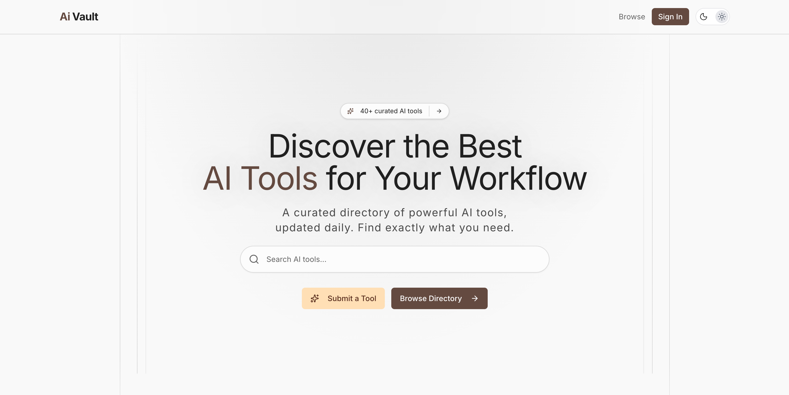
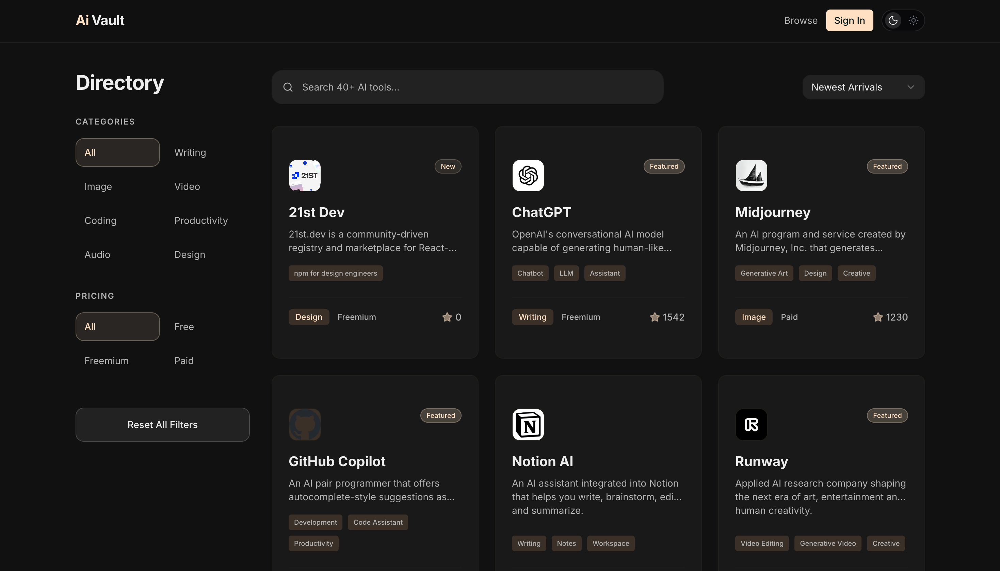
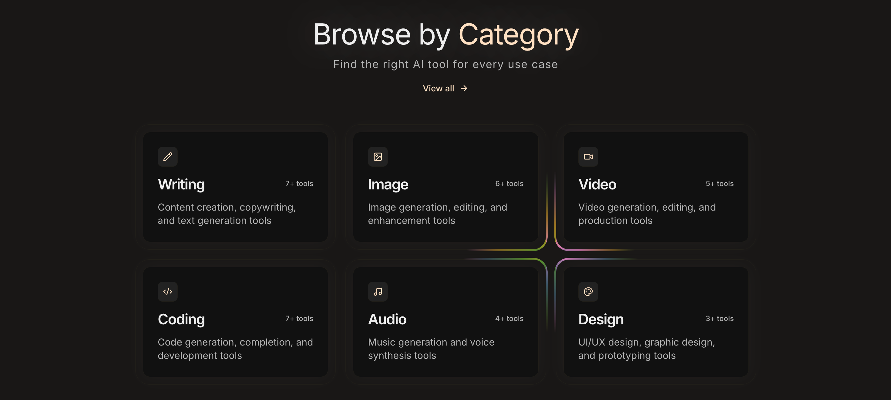
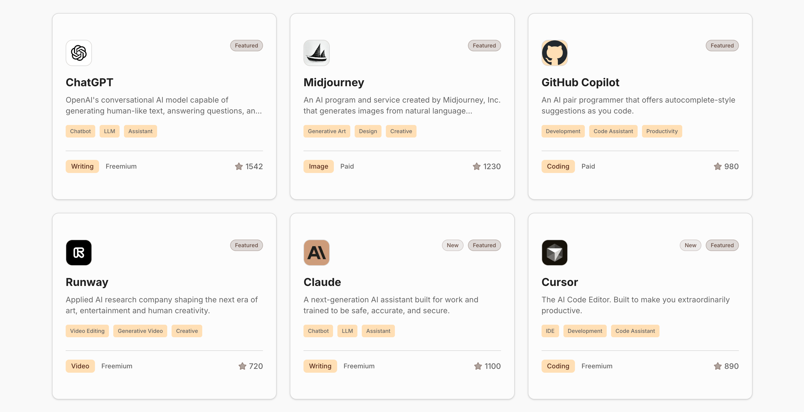
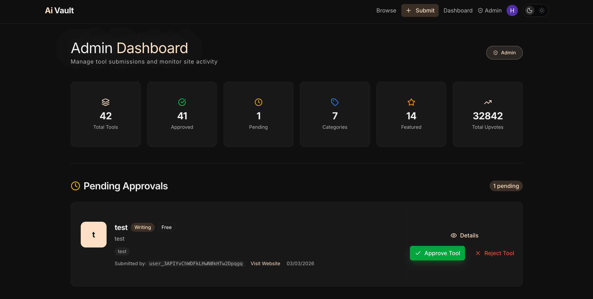

# 🛡️ Ai Vault

**Ai Vault** is a high-performance, premium curated directory built with **Next.js 15**, **Convex**, and **Clerk**. Discover, share, and manage the best AI tools with a modern, secure, and blazing-fast interface.

Created by **Seyar Hasir**.

---

## ✨ Key Features

- 🔍 **Advanced Discovery** — Powerful real-time search and multi-layer filtering by category (Writing, Image, Coding, etc.) and pricing (Free, Freemium, Paid).
- 🔐 **Secure Identity** — Integrated with **Clerk** for seamless authentication and **Convex** for server-side identity verification (`ctx.auth`).
- ⚡ **Real-time Engine** — Instant data updates and synchronization powered by the Convex serverless backend. No manual refreshing needed.
- 🎨 **Premium Aesthetics** — A sleek, modern interface featuring glassmorphism, smooth Framer Motion animations, and a curated dark-mode first design system.
- 🛠️ **Admin Management** — A comprehensive administrative dashboard to review, approve, or reject tool submissions with automated feedback.
- 📱 **Mobile First** — Completely overhauled mobile experience with a dedicated drawer-based filtering system and a responsive navigation menu.
- 📈 **Stats & Monitoring** — Real-time analytics for admins to track tool counts, approval rates, and user engagement.

---

## 📸 Project Showcase

### 🏠 Hero Section


### 📂 Tools Directory & Filtering


### 🏷️ Category Selection


### ⭐ Featured Tools


### ⚙️ Admin Control Panel


---

## 🛠️ Tech Stack

- **Frontend:** [Next.js 15+](https://nextjs.org/) (App Router, React 19)
- **Styling:** [Tailwind CSS 4](https://tailwindcss.com/) & [shadcn/ui](https://ui.shadcn.com/)
- **Backend/Database:** [Convex](https://www.convex.dev/) (Reactive Serverless Database)
- **Auth:** [Clerk](https://clerk.com/) (JWT-based session management)
- **Animations:** [Motion (Framer Motion)](https://www.framer.com/motion/)
- **Icons:** [Lucide React](https://lucide.dev/)
- **Emailing:** [Resend](https://resend.com/) (Custom transactional templates)

---

## 🚀 Future Plans (Roadmap)

We are constantly working to make **Ai Vault** the #1 destination for AI discovery. Here's what's coming next:

- [ ] **AI-Powered Recommendations** — Personalized tool suggestions based on your bookmarks and interests.
- [ ] **User Pro Profile** — A dedicated space for users to showcase their submitted and favorite tools.
- [ ] **Comparison Tool** — Side-by-side comparison of AI tools across features, pricing, and performance.
- [ ] **Community Reviews & Ratings** — Enhanced social features for in-depth community feedback.
- [ ] **Chrome Extension** — Quickly save AI tools to your vault while browsing the web.
- [ ] **API Access** — Public API for developers to integrate Ai Vault data into their own projects.

---

## 🔒 Security Architecture

Ai Vault is designed with a **Security-First** mindset:
- **Server-Side Validation**: All data mutations derive identity directly from authorized Clerk tokens via Convex `ctx.auth`.
- **RBAC (Role-Based Access Control)**: Admin access is strictly enforced via a whitelist of User IDs stored in secure environment variables.
- **Input Sanitization**: All user-submitted content is validated against Zod schemas before hitting the database.
- **CSRF & XSS Protection**: Leverages Next.js and React's built-in protections combined with strict Content Security Policies.

---

## 🛠️ Local Development

### Prerequisites
- Node.js 20+
- [Convex Account](https://www.convex.dev/)
- [Clerk Account](https://clerk.com/)

### Setup Instructions

1. **Clone the repo**
   ```bash
   git clone https://github.com/seyarhasir/AiVault2.git
   cd AiVault2
   ```

2. **Install dependencies**
   ```bash
   npm install
   ```

3. **Environment Setup**
   Create a `.env.local` file and add your credentials:
   ```env
   # Clerk
   NEXT_PUBLIC_CLERK_PUBLISHABLE_KEY=pk_test_...
   CLERK_SECRET_KEY=sk_test_...

   # Convex
   NEXT_PUBLIC_CONVEX_URL=https://your-deployment.convex.cloud

   # Admin Security
   NEXT_PUBLIC_ADMIN_USER_IDS=user_2th...
   ```

4. **Launch Backend & Frontend**
   ```bash
   # In one terminal
   npx convex dev

   # In another terminal
   npm run dev
   ```

---

## 📄 License

Distributed under the MIT License. See `LICENSE` for more information.

---

<p align="center">
  Built with ❤️ by <b>Seyar Hasir</b>
</p>
